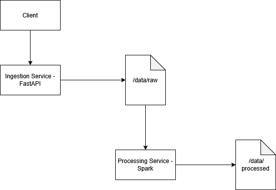

Mini Data Platform – Ingestion & Spark Processing
Overview

This project is a small, end-to-end data platform demo designed to showcase how ingestion, batch processing, and containerized services can work together in a clean, decoupled architecture.

The focus is not on performance, but on:

clear separation of responsibilities

reproducible local execution

explainable architecture suitable for interviews

The platform consists of two independent services:

an Ingestion Service (API-based)

a Processing Service (Spark batch job)

Both services exchange data through a shared data layer.

Services
1. Ingestion Service

Technology: Python, FastAPI, Pandas, Docker

Responsibilities:

exposes an HTTP API for CSV uploads

performs minimal schema validation

stores incoming data in the raw data layer

Endpoints:

GET /health – health check

POST /ingest/csv – CSV ingestion endpoint

The service is stateless. Data persistence is handled by the shared storage layer.

2. Processing Service

Technology: Python, Apache Spark (PySpark), Docker

Responsibilities:

reads all raw CSV files

performs batch processing using Spark (local mode)

aggregates events by type

writes processed output to the processed data layer

This service runs as a batch job, not a long-running API.

Data Layers

The platform uses two simple data layers:

data/
├── raw/        # input CSV files (bronze layer)
└── processed/  # aggregated output (silver layer)

In local development, these layers are implemented as mounted Docker volumes.
In a production setup, they would be replaced by object storage (e.g. S3) or a distributed filesystem.

## Design Decisions

- Ingestion and processing are separated into two services to mirror real data platforms.
- Spark is used in local mode to demonstrate distributed processing concepts without cluster overhead.
- Data is exchanged via shared volume to simulate object storage (S3/GCS).
- Docker is used to ensure reproducibility and CI compatibility.

Running the Project (Windows + Docker Desktop)
Prerequisites

Docker Desktop (Windows)

Git

curl (available in CMD)

1. Start the Ingestion Service
docker-compose up --build ingestion

The API will be available at:

http://localhost:8000

Health check:

curl http://localhost:8000/health

2. Ingest Sample Data
curl -X POST "http://localhost:8000/ingest/csv" -F "file=@input/sample.csv"

A CSV file will appear in:

data/raw/

3. Run the Processing Service
docker-compose run --rm processing

Processed output will be written to:

data/processed/

4. Stop the Platform
docker-compose down

Why This Design

Key architectural decisions:

Decoupled services – ingestion and processing are independent

Stateless containers – no data baked into images

Shared storage layer – explicit data exchange point

Docker & docker-compose – reproducible local environment

This mirrors real-world data platform design while keeping the project intentionally lightweight.

What This Project Demonstrates

API-based data ingestion

Batch data processing with Spark

Basic ETL concepts

Containerized services

Local orchestration with docker-compose

Clear separation between code and data

Possible Extensions

Add a scheduler (e.g. Prefect or Airflow)

Replace local storage with cloud object storage

Add schema validation and data quality checks

Expose processed data via an API

Add monitoring and logging

Author

Built as a hands-on learning project to explore data platforms, distributed processing concepts, and container-based workflows.

## Scaling Considerations

If this were production-grade:
- Raw data would be stored in S3/GCS instead of local volumes
- Spark would run on a cluster (EMR / Dataproc)
- Orchestration would be handled by Airflow
- Schema evolution would be managed via a metastore